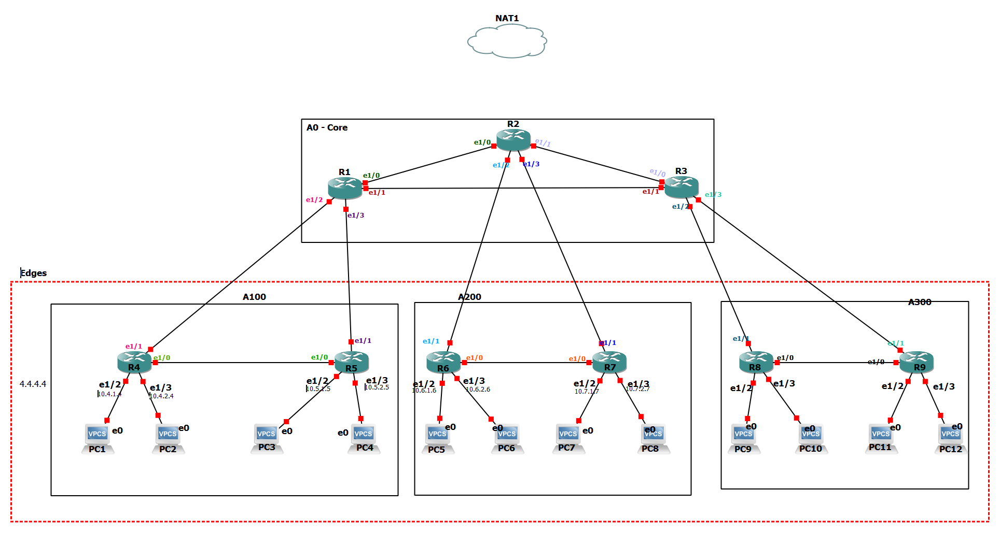

# Section 1 
this is a heading 

## Section  1.2 
This is a sub section

## 1.3. Image 



## 1.4. Equation 

$ f(x) = \frac{sin(x)}{K_{time}}$

## 1.5. Tables
| routing protocols | SPA |
|---|---|
| RIP | Bellman ford | 
| EIGRP | DUAL  |
| OSPF | SPF |
| ISIS | SPF | 

The $R_1$ is a _backbne router_ and the $R_5$ is under __Area 1__. The `show ip ospf neighbor` command shows all OSPF neighbours.

## 1.6. Scripts 
### 1.6.1. Standalone Scripts

```
conf t
   router os {PID}
       router-id {RID}
       pass def
       net {NET_ID} {MASK} area {AID}
       no pass {IFACE}
    exit
end
```
### 1.6.2. Standalone scripts from known programming language (python)

```
def hello():
    name = input('Enter your name: ')
    print(f'Hello {name}')

hello()
```

```
def hello():
    name = input('Enter your name: ')
    print(f'Hello {name}...')

hello()
```

## 1.7. Bullets and Numbres

* section 1
    * section 1.1
    * section 1.2.
    * section 1.3
* Section 2
    * section 2.1.
    * section 2.2.
    
1. section 1
2. section 2
